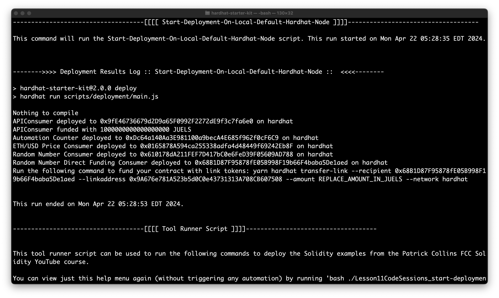

These are my notes while working on [Patrick's Javascript Blockchain/Smart Contract FreeCodeCamp Course](https://www.youtube.com/watch?v=gyMwXuJrbJQ).

- On April 22, 2024 successfully compiled and deployed the examples in this `hardhat-starter-kit` to a local Hardhat node, but I was not able to deploy the smart contracts to Ethereum Testnet because of an issue with the deploy scripts.



---
### Technical Requirements

Check the basic technical requirements from Patrick's original GitHub repo. For convenience, MacOS users can run `bash ./Lesson11CodeSessions_start-deployment-scripts.sh Install-Tools-On-MacOS-Or-Linux` from the root of this repo to help quickly install the required tools.

### Quick Start Script

After the basic technical requirements are installed and working, then you can run the `bash ./Lesson11CodeSessions_start-automation-build-pipeline.sh` script. This automation script will start a sequence of the scripts listed below, and is meant to behave like a typical build pipeline.

### Current Toolkit Capabilities
```
You can view just this help menu again (without triggering any automation) by running 'bash ./Lesson11CodeSessions_start-deployment-scripts.sh -h' or 'bash ./Lesson11CodeSessions_start-deployment-scripts.sh -h --help'.

bash ./Lesson11CodeSessions_start-deployment-scripts.sh Stop-Local-Blockchain-Nodes-Clean-Environment
bash ./Lesson11CodeSessions_start-deployment-scripts.sh Install-Tools-On-MacOS-Or-Linux
bash ./Lesson11CodeSessions_start-deployment-scripts.sh Start-Deployment-On-Local-Default-Hardhat-Node
bash ./Lesson11CodeSessions_start-deployment-scripts.sh Start-Deployment-On-Real-Ethereum-Testnet
bash ./Lesson11CodeSessions_start-deployment-scripts.sh Start-Hardhat-Test

If you're running this for the first time run the following before running any of these scripts.

bash ./Lesson11CodeSessions_start-deployment-scripts.sh Install-Tools-On-MacOS-Or-Linux

Then you can run the following combined commands in your terminal to deploy the contract to the Hardhat local blockchain node.

bash ./Lesson11CodeSessions_start-deployment-scripts.sh Stop-Local-Blockchain-Nodes && bash ./Lesson11CodeSessions_start-deployment-scripts.sh Start-Deployment-On-Local-Default-Hardhat-Node
```
